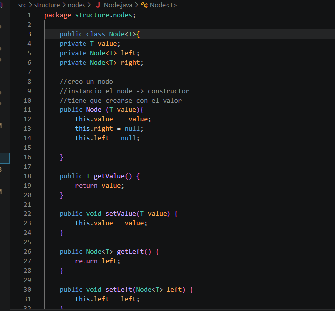
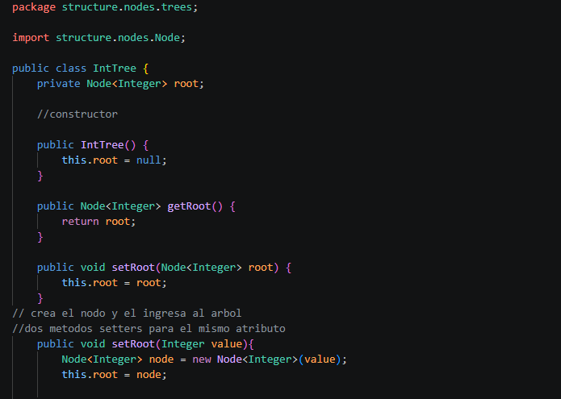
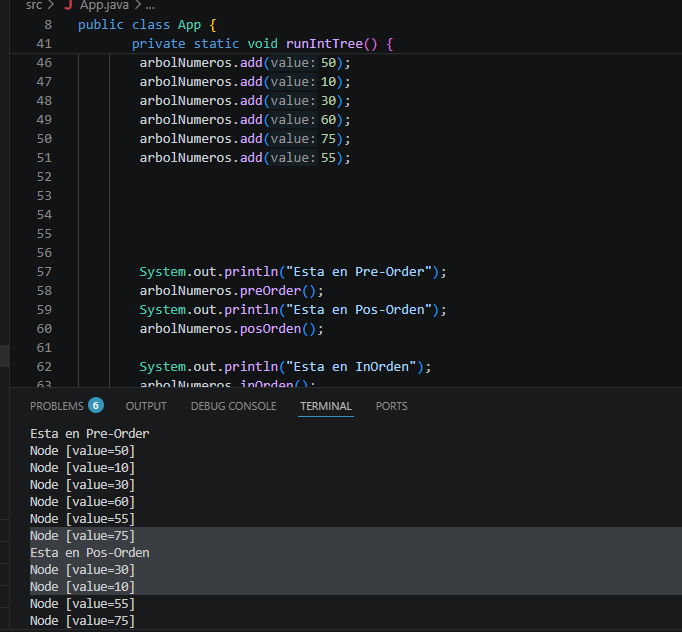
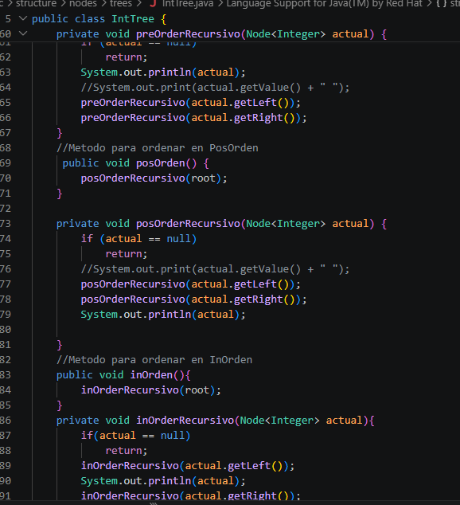
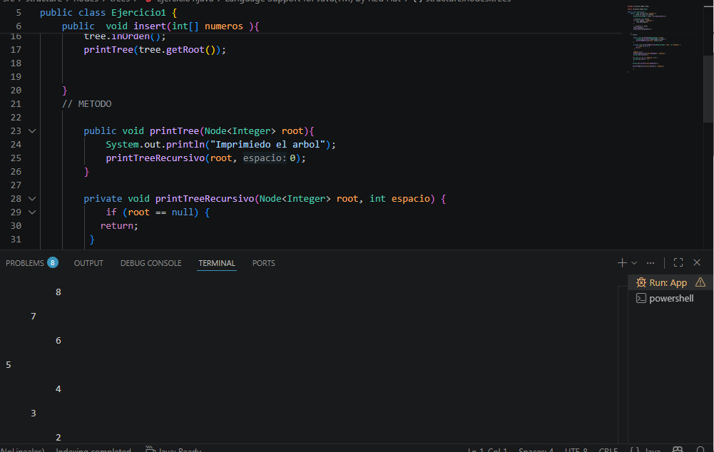
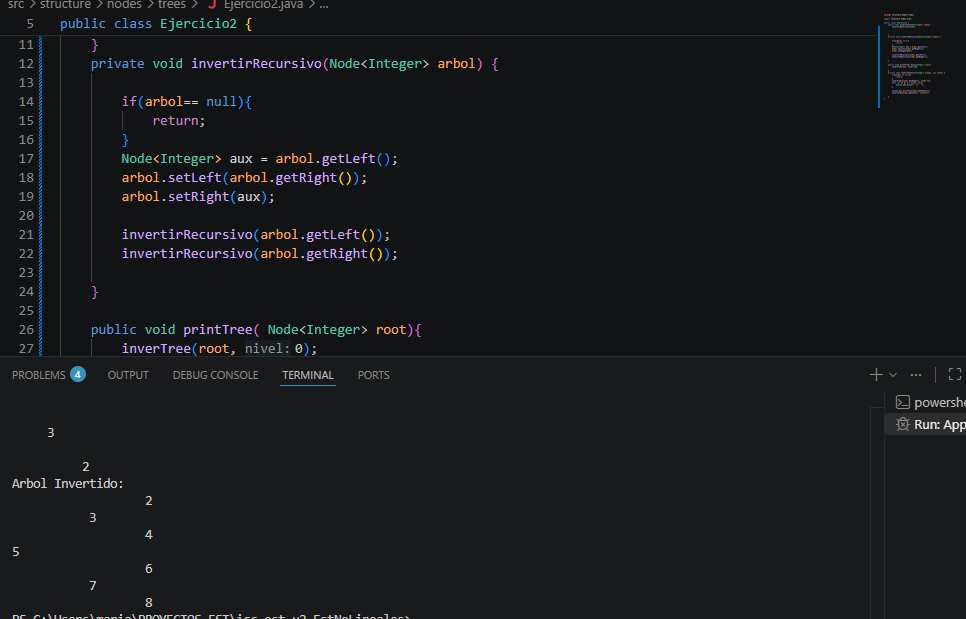

# Clase de Estructuras no lineales 
## Metodos de orden pre, pos y in
### Nombre: Andy Uyaguari
### Fecha: 17 de junio, 2026

## Descripcion clase del miercoles:
Se creo las clase y los paquetes para relizar los metodos de orden. Creamos una clase node con sus atributos de tipo generico
tambien la clase Intree donde vamos agregar los metodos preorden, posorden y inorden.

## Descripcion clase del Viernes:
En esta clase imlementamos los metodos de orden posorden, preorden y inorden y los instanciamos en el app para mostrar al ejecuatar el codigo. Ademas impelemtamos un metodo que nos da laaltura del arbol y tambien otro metodo que nos da el peso del arbol

## Descripcion clase del Lunes :
implemetamos un metodo para que nos imprima en forma de piramide verticalmente y tambien lo hicimos de forma invertidad 

