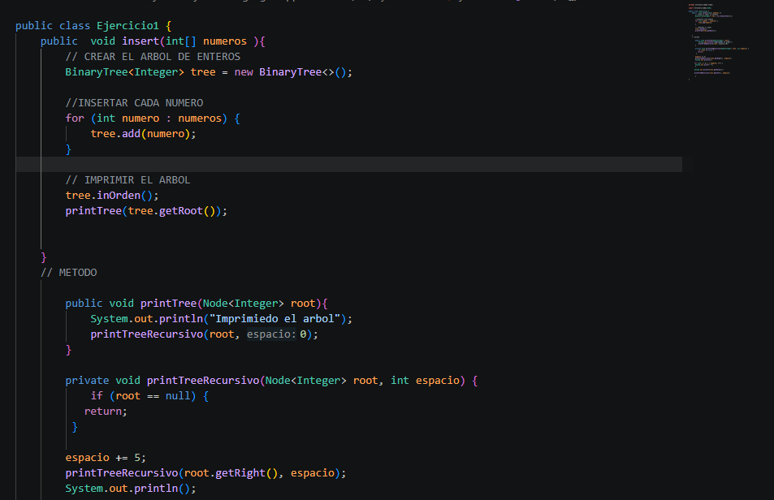

# Universidad Politecnica Salesiana 
## Practica :Estructuras no Lineales-Arboles Binarios
### Nombre: Andy Uyaguari

## Descripcion del proyecto:
En la pratica aprendimos a usar estructuras de datos no lineales utilizando arboles binarios. Implementamos diferentes algoritmos sobre arboles binarios:

-Insercion de nodos en un arbol binario de busqueda.

-Listado de nodos por niveles.

-Calculo de la profundidad maxima del arbol

## Ejercicio1
### Descripcion:
Implementamosun metodo que recibe un arreglo de numeros y genera un arbol binario de busqueda. Cada elemento se inserta utilizando el metodo add() de la clase BinaryTre.
### Metodo utilizado 
insert(int[] numeros);
Este metodo: Crea un arbol de enteros, recorre el arreglo y inserta cada numero en el arbol. Luego imprime el arbol
## Ejercicio2 
### Descripcion: 
En este ejercicio invertimos la estructura del arbol intercambiando los hijos izquierdo y derecho de cada nodo se utiliza recursividad para recorrer todos los nodos.
### Metodo utilizado 
invertTree(Node Interger  root)

Guarda temporalmente el hijo izquierdo luego coloca el derecho en la izquierda y coloca el hijo izquierdo en la derecha

## Ejercicio3: Listar niveles del arbol
### Descripcion:
Se desarrollo un algoritmo que devuelve los nodos del arbol separados por niveles se utiliza una estructura tipo cola para relizar un recorrido por amplitud.
### Metodo utilizado 
ListLevels(Node root);
Agregamos la raiz a una cola se recorre los nodos del mismo nivel y se guarda en una lista. Repetimos hasta que termine el arbol.

## Ejercicio4 : Profundidad maxima 
### Descripcion:
En este ejercicio calcula la profundidad maxima del arbol. Representa el camino mas largo desde la raiz hasta la hoja.
### Metodo utilizado 
maximoDepht(Node Integer root );
Recorre el lado izquierdo y lo mismo del lado derecho, luego compara cual tiene mayor profundidad y retorna profundidad mayor mas 1.

 
